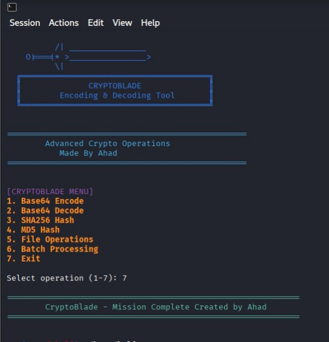

# CryptoBlade 🔪 - Advanced Encoding & Hashing Toolkit




**CryptoBlade** is a professional-grade Bash toolkit for penetration testers, security researchers, and developers. Features Base64 encoding/decoding, SHA256/MD5 hashing, file operations, and batch processing with an intuitive sword-themed interface.

## 🚀 Features

| Feature | Description |
|---------|-------------|
| 🔄 **Base64** | Encode/Decode text & files |
| 🔐 **SHA256** | Secure hashing for text/files |
| ⚡ **MD5** | Fast hashing for legacy compatibility |
| 📁 **File Ops** | Encode/decode/compare files |
| ⚙️ **Batch** | Process entire directories |
| 🎨 **UI** | Color-coded, ASCII sword banner |

## 📋 Prerequisites

```bash
# Debian/Ubuntu
sudo apt update && sudo apt install coreutils -y

# Arch Linux
sudo pacman -S coreutils

# macOS
# Already included by default

